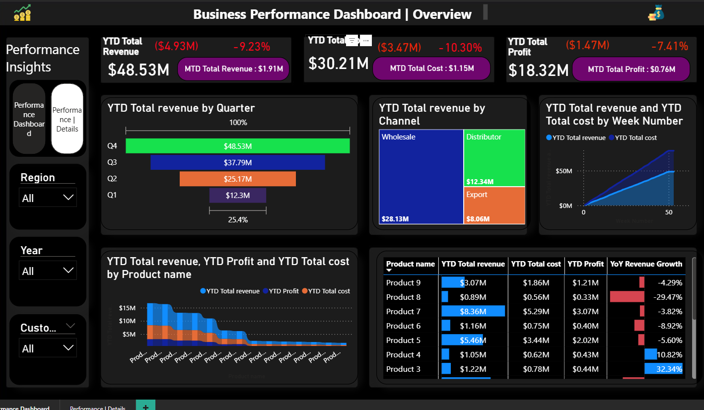
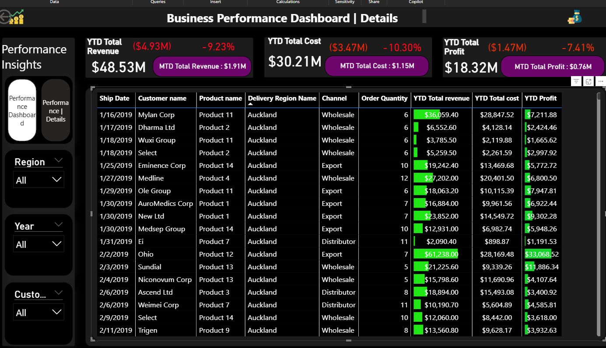

# 📊 Business Performance Dashboard — Power BI

> An executive-level business performance dashboard built in Power BI, tracking revenue, cost, and profit KPIs with Year-to-Date (YTD), Month-to-Date (MTD), and Year-over-Year (YoY) intelligence across products, customers, regions, and sales channels.

---

## 🖼️ Dashboard Preview

### Page 1 — Performance Dashboard (Summary)


### Page 2 — Performance | Details


> **Note:** Screenshots can be added by opening the `.pbix` file in Power BI Desktop and taking a snapshot of each page.

---

## 📋 Project Overview

| Field | Details |
|-------|---------|
| **Tool** | Microsoft Power BI Desktop |
| **Domain** | Business Intelligence / Sales Analytics |
| **Data Model** | Star Schema |
| **Pages** | 2 (Summary + Details) |
| **DAX Measures** | 15 |
| **Visual Types** | Card, Funnel, Ribbon Chart, Stacked Area Chart, Treemap, Table, Slicer, Page Navigator |
| **Created** | March 2024 |
| **Author** | Ian Mutuma |

---

## 🎯 Business Problem

Business stakeholders needed a single, interactive view to monitor **sales performance** across multiple dimensions — product lines, customer segments, regions, and channels — without manually compiling spreadsheets each month.

The dashboard answers:
- How is the business performing **this year vs last year**?
- Which **products, customers, and regions** are driving revenue?
- Where are **costs increasing** relative to revenue?
- How is **profit trending** month-over-month?
- Which **sales channels** are most effective?

---

## 📐 Data Model (Star Schema)

```
                    ┌─────────────┐
                    │  DimProducts │
                    │ Product name │
                    └──────┬──────┘
                           │
┌──────────────┐    ┌──────▼──────┐    ┌─────────────────┐
│  DimCustomer │────│  FactSales  │────│    DimRegion     │
│ Customer name│    │             │    │ Delivery Region  │
│   Channel    │    │ Order Qty   │    │    Channel       │
└──────────────┘    │ Ship Date   │    └─────────────────┘
                    │ Revenue     │
                    │ Cost        │    ┌─────────────┐
                    │ Profit      │────│  Date_Table  │
                    └─────────────┘    │ Year/Quarter│
                                       │ Week/Month  │
                                       └─────────────┘
```

### Tables
| Table | Type | Description |
|-------|------|-------------|
| `FactSales` | Fact | Core transaction data — orders, revenue, cost |
| `DimProducts` | Dimension | Product catalogue |
| `DimCustomer` | Dimension | Customer details and channel |
| `DimRegion` | Dimension | Delivery regions and geography |
| `Date_Table` | Dimension | Date intelligence — Year, Quarter, Week |

---

## 📊 Dashboard Pages

### Page 1 — Performance Dashboard (Summary View)

**KPI Cards (9):**
| KPI | Description |
|-----|-------------|
| YTD Total Revenue | Year-to-date cumulative revenue |
| YTD Total Cost | Year-to-date cumulative cost |
| YTD Total Profit | Year-to-date cumulative profit |
| MTD Revenue KPI | Month-to-date revenue with trend indicator |
| Revenue Difference | Variance vs prior period (colour-coded) |
| Cost Difference | Cost variance vs prior period |
| Profit Difference | Profit variance vs prior period |
| YoY Revenue Growth | Year-over-year revenue growth % |
| YoY Profit Growth | Year-over-year profit growth % |

**Charts:**
- 📈 **Stacked Area Chart** — Revenue trend over time
- 🎀 **Ribbon Chart** — Ranking of products/channels by performance
- 🔻 **Funnel Chart** — Sales pipeline or conversion stages
- 🌳 **Treemap** — Revenue breakdown by category hierarchy
- 📋 **Detail Table** — Granular transaction-level view

**Slicers (3):** Year · Quarter · Channel (enabling cross-filter across all visuals)

---

### Page 2 — Performance | Details

Deep-dive analytical view with:
- Full data table for drill-through and row-level analysis
- Same KPI card suite for context
- Consistent slicers (Year · Quarter · Channel)
- Navigation button back to Summary page

---

## 🧮 DAX Measures

All measures are stored in a dedicated measures table for clean model organisation.

```dax
-- Year-to-Date Revenue
YTD Total Revenue = 
TOTALYTD(SUM(FactSales[Revenue]), Date_Table[Date])

-- Month-to-Date Revenue KPI
MTD Revenue KPI = 
TOTALMTD(SUM(FactSales[Revenue]), Date_Table[Date])

-- Year-over-Year Revenue Growth
YoY Revenue Growth = 
DIVIDE(
    [YTD Total Revenue] - CALCULATE([YTD Total Revenue], SAMEPERIODLASTYEAR(Date_Table[Date])),
    CALCULATE([YTD Total Revenue], SAMEPERIODLASTYEAR(Date_Table[Date]))
)

-- Revenue Difference (vs prior period)
Total Revenue Difference = 
[YTD Total Revenue] - CALCULATE([YTD Total Revenue], SAMEPERIODLASTYEAR(Date_Table[Date]))

-- Dynamic color coding for variance indicators
Revenue Difference Color = 
IF([Total Revenue Difference] >= 0, "Green", "Red")
```

> The full 15 measures cover Revenue, Cost, and Profit across YTD, MTD, YoY, and difference/color-coding variants.

---

## 🎨 Design Decisions

- **Dark theme** — Professional, executive-ready aesthetic with high contrast for data visibility
- **Colour-coded KPI indicators** — Green/Red dynamic formatting on variance measures for instant insight
- **Page navigator** — Seamless navigation between Summary and Details pages
- **Consistent slicers** — Synchronised Year, Quarter, and Channel filters across both pages
- **Star schema** — Clean separation of facts and dimensions for optimal DAX performance and scalability

---

## 🚀 How to Use

### Prerequisites
- [Power BI Desktop](https://powerbi.microsoft.com/desktop/) (free) — any version from March 2024 onwards

### Steps
1. Clone or download this repository
2. Open `Business_performance_dashboard.pbix` in Power BI Desktop
3. If prompted about data source, connect to your own dataset (see **Data Schema** below)
4. Explore using the slicers (Year, Quarter, Channel) to filter all visuals
5. Navigate between pages using the page navigator at the bottom

### Reconnecting Your Own Data
The dashboard is designed to work with any dataset matching this schema:

```
FactSales columns:
├── Order Quantity    (number)
├── Ship Date         (date)
├── Revenue/Sales     (number)
├── Cost              (number)
└── [FK keys to dimensions]

DimCustomer columns:
├── Customer name     (text)
└── Channel           (text)

DimProducts columns:
└── Product name      (text)

DimRegion columns:
└── Delivery Region Name (text)

Date_Table columns:
├── Date              (date — mark as Date Table)
├── Year              (number)
├── Quarter           (text)
└── Week Number       (number)
```

---

## 📁 Repository Structure

```
business-performance-dashboard/
│
├── Business_performance_dashboard.pbix   ← Main Power BI file
├── README.md                              ← This file
│
├── assets/
│   ├── page1_performance_dashboard.png   ← Dashboard screenshot (add manually)
│   ├── page2_performance_details.png     ← Details page screenshot (add manually)
│   └── data_model.png                    ← Star schema diagram (optional)
│
└── docs/
    ├── dax_measures.md                   ← Full DAX measure documentation
    └── data_dictionary.md                ← Column definitions
```

---

## 💡 Key Learnings

- **Time intelligence in DAX** — Implementing TOTALYTD, TOTALMTD, and SAMEPERIODLASTYEAR correctly requires a properly marked Date Table
- **Dynamic formatting** — Using DAX measures to drive conditional colours on KPI cards eliminates the need for manual formatting rules
- **Star schema performance** — Keeping dimensions separate from the fact table significantly improves DAX calculation speed on large datasets
- **Page navigation** — Power BI's built-in page navigator component creates a polished, app-like experience without custom visuals

---

## 🔗 Connect

**Ian Mutuma**
- 📧 mutumian29@gmail.com
- 💼 [LinkedIn](https://linkedin.com/in/ian-mutuma-3639bb280)
- 🐙 [GitHub](https://github.com/mutumaian29)

---

*Built with Power BI Desktop · March 2024*
